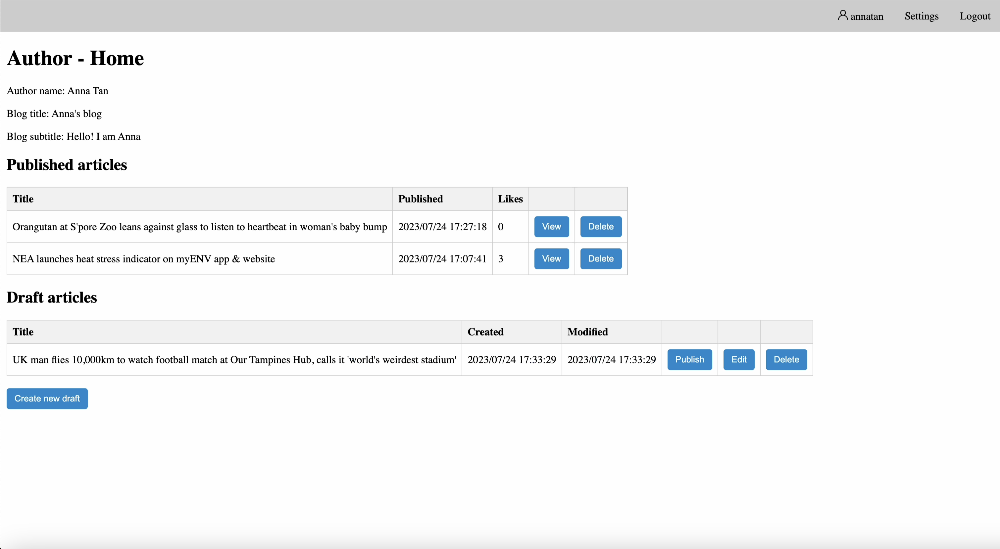
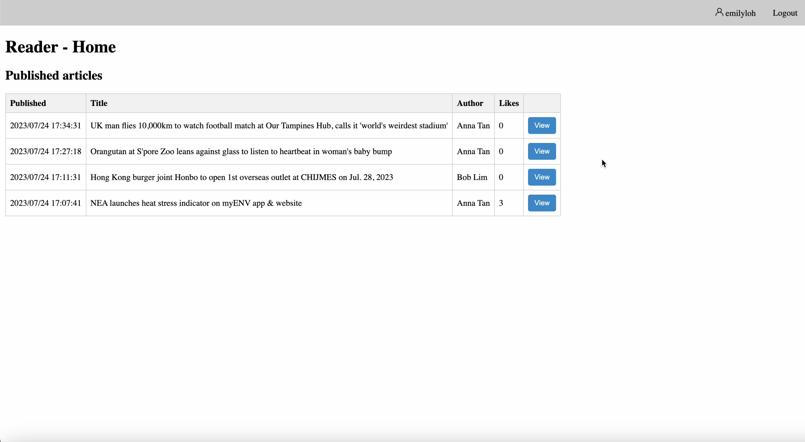
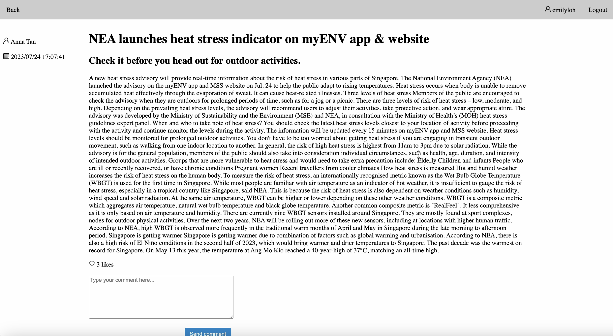

# Blogging Tool

## About

This application is a blogging tool developed in Node.js using SQLite database. Authors can create, update, delete and publish articles from the home page. Both authors and readers can view, like and comment on articles.

## Author Home Page

## Reader Home Page

## View Article Page

